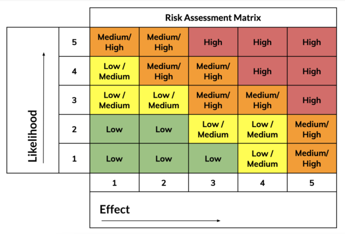

- techniques for risk estimation:
	- [[scenario analysis]]
	- [[sensitivity analysis]]
	- [[decision tree analysis]]
	- [[multi-attribute analysis]]
- one common technique is a **risk assessment matrix**: a grid of impact and likelihood
	- 