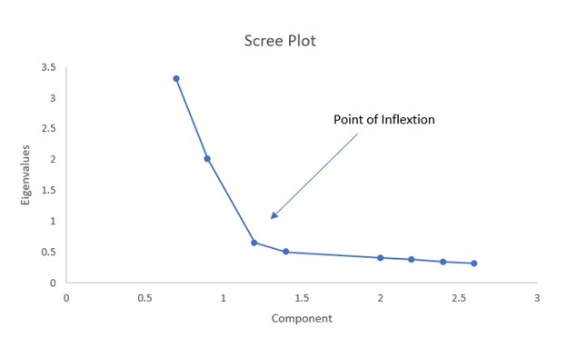

tags:: stats, dataviz, PCA

- a plot of the principal components of some data, against their [[eigenvalues]]:
	- 
	-
- we can use this to choose the number of components we'll use in [[PCA]].
	- we'll look at this plot for a point of inflection, and take all the components above that level.
	- if there's not a clear point of inflection, we can also set a hard cap, and choose all components above it. e.g. aim for something like "90% of variance in the data"