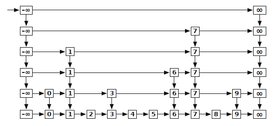

- a skip list is a data structure with many of the same properties as a [[binary search tree]], but a totally different representation!
- start with a sorted [[linked list]]. then add a list of random shortcuts, with probability $1/2$ that each node appears in the shortcuts. then recursively add more shortcuts until you have a layer with no nodes but the sentinels. (or equivalently, flip a coin for each node til it comes up tails)
	- 
- to find an element, start on the left. if the right element is smaller than your target value, go right. otherwise, go down.
- this has probabilistic performance of $\Theta(\log n)$ for all operations. the worst case could be infinite! but it has super rare probability.