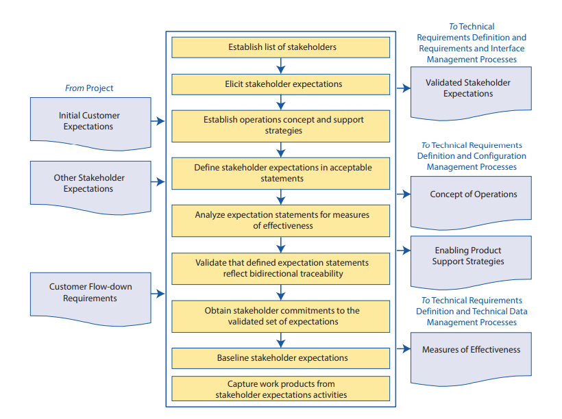

- the process of figuring out what the stakeholders want, and turning it into an explicitly documented and agreed-upon standard
	- {:height 488, :width 637}
- stakeholders might change throughout the project's lifecycle!
- this is also the stage where you'll define [[MOEs]] and a [[concept of operations]]