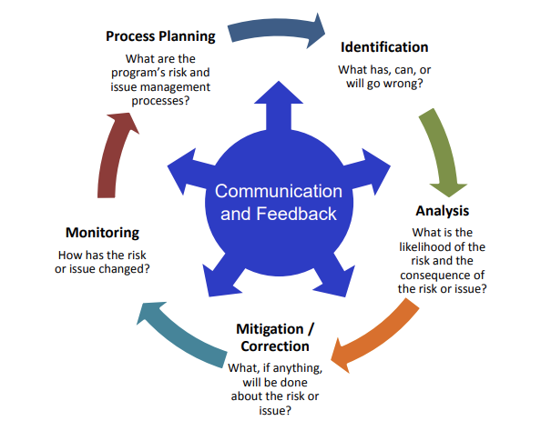

- see also [[risk management]] for a more general take.
- risk naturally declines over the lifetime of a program, as more and more of it is completed, and we learn more and have fewer unknowns. but the amount at stake increases.
- an **issue** differs from a **risk** because an issue is certain. risk is, by nature, probabilistic. dealing with risk fundamentally requires managing [[uncertainty]].
	- for each risk, you need to consider both its likelihood, and its consequence. you can write risks in an if-then format to help with this. "if X happens, then Y negative consequence will result. we think X is Z% likely."
	- you can also think of **opportunities** as the dual of risk- probabilistic chances to do _better_ than expected. consider these too.
	- a similar (but parallel) feedback cycle might be used for risks, issues, and opportunities.
- there's a cycle from: Process Planning -> Risk Identification -> Risk Analysis -> Risk Mitigation -> Risk Monitoring -> Process Planning
	- 
	- **Process Planning:** establish roles & responsibilities, document the process and schedule. but also establish *traceability* of risk so you know where each risk comes from!
	- **Identification:** what can go wrong? what is uniquely challenging about this system? what don't we know yet? consider risks that could impact any of schedule, cost, or performance. ideally, use several different methodologies too- trade studies, interviews with stakeholders and SMEs, historical context, independent assessors... only assess _what_ the risks are here.
	- **Analysis:** Once we know what the risks are, we need to know how likely they are and how bad their consequences are. you can group consequences by severity 1-5, and likelihood 1-5. that lets you construct a 5x5 matrix of risk severity. keep track of all these risks in a risk register.
	- **Mitigation:** which risks ought we to address? what can we do to reduce the likelihood or consequences? for each, establish- what should be done, who should do it, when, the predicted impact, and the necessary resources. build a burn-down chart to track mitigation efforts over time.
	- **Monitoring:** how have the risks evolved? did the mitigation work? are additional actions needed? set up ongoing reporting and tracking procedures so that you can know this.
- three types of risk:
	- **technical**
	- **programmatic** - non-technical risk under the control of the PM or business office that owns the program
	- **business (external)** - non-technical risk coming from outside the program entirely. like weather, market factors, etc.
- the four methods of addressing risk:
	- **mitigate** - take some steps to reduce the risk.
	- **accept** - take it on the chin! accept the risk, but you should probably continue to monitor it.
	- **transfer** - make it someone else's problem! delegate the risk to another entity. for example, contract it out, or move the responsibility to a different department.
	- **avoid** - don't do the risky thing.
- risk management should be _both_ top-down and bottom-up. it won't be successful if it's not factored into the program plan at the highest levels. it equally won't be successful if folks on the ground aren't buying in and doing it.