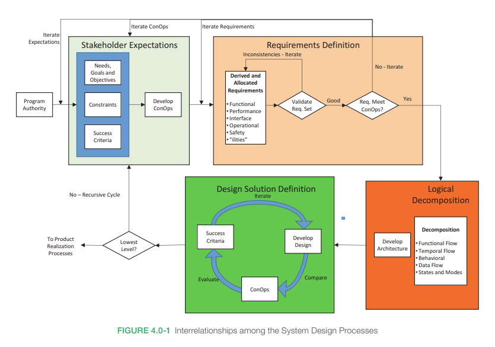

- in NASA's model, has four main activities:
	- {:height 437, :width 612}
	- [[stakeholder expectations]] definition
	- [[syseng/requirements]] definition
	- logical decomposition
	- design solution definition
- compare with software engineering [[system design]]