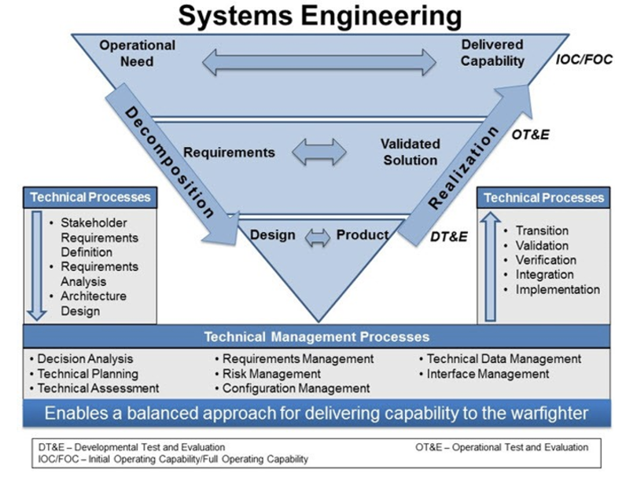
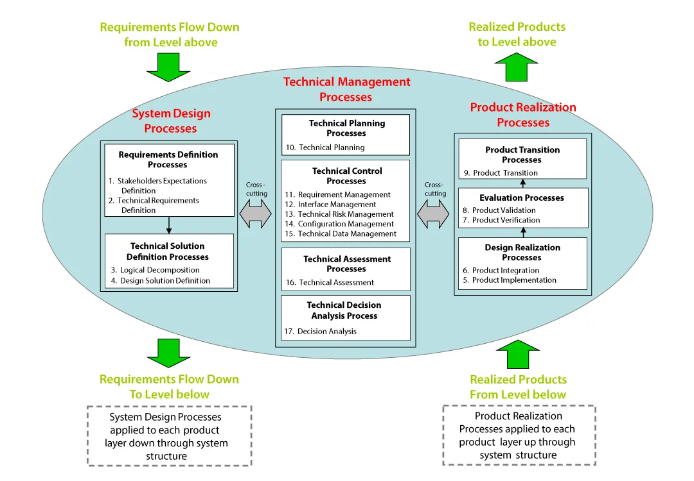
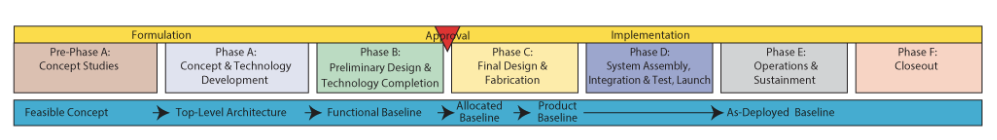

- application of engineering to [[system (engineering)]]s
- per [[INCOSE]]:
	- > Systems Engineering is a [[transdisciplinary]] and [[integrative]] approach to enable the successful realization, use, and retirement of engineered systems, using systems principles and concepts, and scientific, technological, and management methods.
- per DOD:
	- > SE is a methodical and disciplined approach for the specification, design, development, realization, technical management, operations, and retirement of a system. SE applies critical thinking to the acquisition of a capability. It is a holistic, integrative discipline, whereby the contributions from across engineering disciplines (e.g., structural engineers, electrical engineers, mechanical designers, software engineers, safety engineers, human factors engineers, reliability engineers) are evaluated and balanced to produce a coherent capability – the system.
	- {:height 357, :width 466}
- per NASA:
	- > A methodical, multi-disciplinary approach for the design, realization, technical management, operations, and retirement of a system.
	- {:height 393, :width 556}
	- 
- as a...:
	- **way of thinking**
		- focus on capabilities! avoid thinking about *solutions* until you truly understand the *requirements*
	- **process**
		- involves both decomposition of an idea into requirements, and realization of those requirements
		- involves many different types of process! system design, technical management, production, and more'
		- distributes tasks into different stages through time
	- **role**
		- broadly, a keeper of the process. managing the SE process & leading technical planning and execution at the system level.
		- analyze and define [[requirements (SE)]] for the system
		- define the interfaces between parts of the system
		- do [[risk management]]
		- do system design
		- plan and coordinate [[testing (SE)]]
		- prep for design reviews
		- decision analysis
- systems engineering helps us:
	- decompose huge projects into a tiered or heirarchical system of human-scale pieces
	- decide how to split work across multiple teams or suppliers
	- fit our work to a defined lifecycle, including not just the R&D, but the testing, sustained operation, training, etc.
	- deal with interdisciplinary concerns, that require many people with different roles and specialties to build
	- square the complexity of our project with the practical demands of budgets and timelines. costs are locked in early, and by the late phases of a project, it's very expensive to change! SE helps us make the well-informed early decisions that avoid piling up late costs.
	- understand our stakeholders and meet their needs
	- verify that our system truly satisfies the requirements we have for it
	- deal with the -ilities: [[reliability]], [[maintainability]], [[manufacturability]]
	- deal with change over time, by establishing a consistent system for tracking requirements changes and planning and executing on them.
- in many ways, similar to [[program management]]!