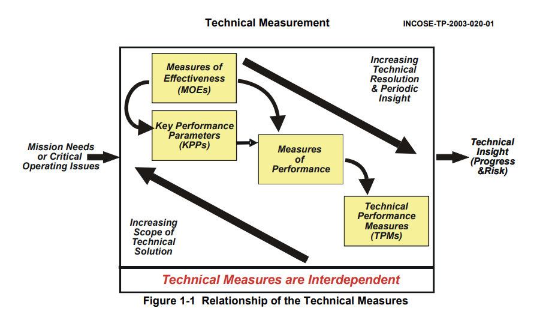
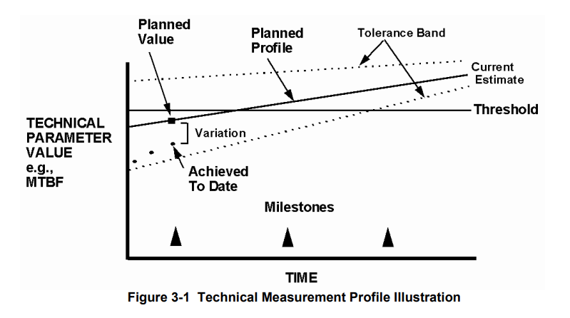

- measurement activities used to provide insight into the project's process and risks. these are typically planned early in the system's lifetime, then done with a progressively increasing level of fidelity as the project moves along. like so:
	- {:height 339, :width 587}
- at the highest level, we might use **MOEs**, measures of effectiveness
	- from INCOSE:
		- > The “operational” measures of success that are closely related to the achievement of
		  the mission or operational objective being evaluated, in the intended operational
		  environment under a specified set of conditions; i.e., how well the solution achieves the
		  intended purpose.
	- these focus on **achieving the desired end result**. are we doing the right thing?
	- they should focus on the real-world performance of the system within the real environment it's used in
	- they should be stated from the user's perspective, not our perspective! compare [[user stories]]
- we might also use **KPPs**, key performance parameters. compare [[KPI]]s
	- from INCOSE:
		- > A critical subset of the performance parameters representing those capabilities and
		  characteristics so significant that failure to meet the threshold value of performance can be cause for the concept or system selected to be reevaluated or the project to be reassessed or terminated.
	- these are the subset of performance characteristics we measure, which if we didn't meet them, the project would be a failure.
	- use these to delineate the "must have"s
	- compare [[KPI]]s/ [[OKR]]s
- **MOPs**, measures of performance
	- from INCOSE:
		- > The measures that characterize physical or functional attributes relating to the system
		  operation, measured or estimated under specified testing and/or operational environment conditions.
	- a measure of a physical or functional requirement, that we'll measure with specific tests or under specific conditions
	- these often roll up to KPPs, and/or map to [[requirements (SE)]]
	- we use these to evaluate if we're meeting our MOEs, as well as to support [[analysis of alternatives]]
- **TPMs**, technical performance measures
	- from INCOSE:
		- > TPMs measure attributes of a system element to determine how well a system or
		  system element is satisfying or expected to satisfy a technical requirement or goal.
	- these measure an attribute of a system element to determine how well it's satisfying a technical requirement or goal
	- they are derived directly from the [[requirements (SE)]]
	- ideally, these are easy enough to measure that we can take repeated snapshots throughout the development cycle!
	- we want to keep the list lean. keep it down to 5-7
	- we might measure how well a TPM is doing over time:
		- {:height 345, :width 605}