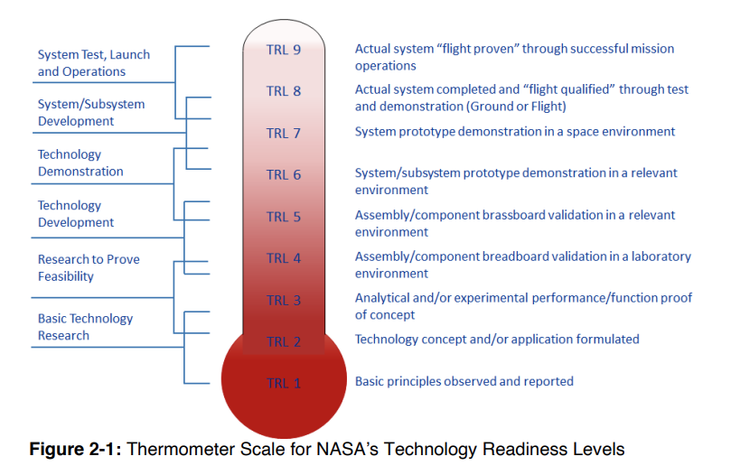

- > A Technology Readiness Assessment (TRA) is a systematic, metrics-based process that assesses the maturity of, and the risk associated with, critical technologies to be used in Major Defense Acquisition Programs (MDAPs). It is conducted by the Program Manager (PM) with the assistance of an independent team of subject matter experts (SMEs).
  * DOD
- "critical technologies" means the ones that pose some technical risk to the success of the system
- we measure Technology Readiness Level with a 1-9 scale, and develop a maturation plan if we aren't up to par
	- {:height 422, :width 638}
	- this might involve building prototype at a variety of fidelity levels, from a rough breadboard up to real production unit