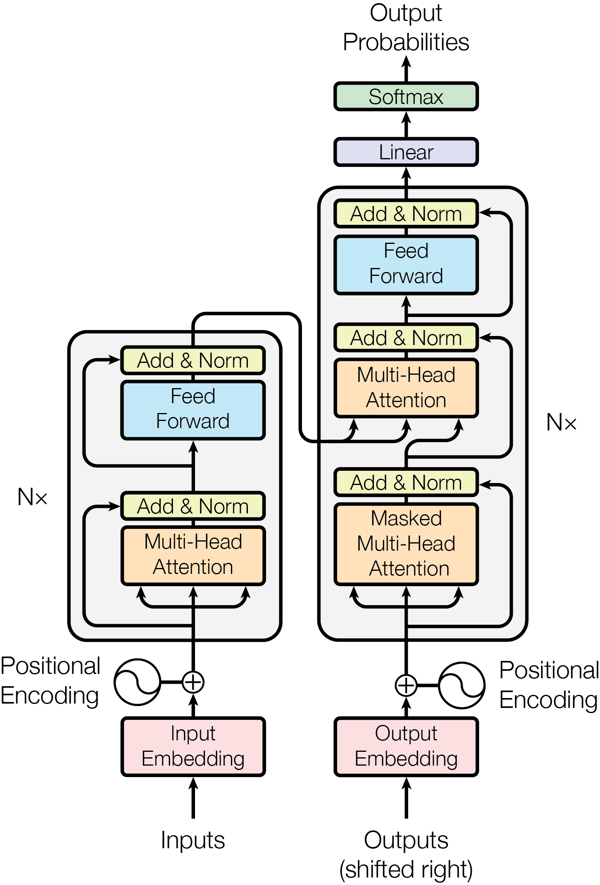

tags:: AI, ml, LLMs

- the basic building block of most [[LLM]]s! overcame the limitations of [[RNN]]s and [[LSTM]]s
- an architecture based on multi-head, causal, scaled dot-product self attention. breaking that down:
	- **multi-head** means that instead of just one instance, multiple instances of attention run in parallel. this allows the model to learn more complex patterns
	- **causal** attention means it ignores future tokens when looking at any given token in the sequence. this gives it a direction in time to inform learned patterns
	- **scaled dot-product**, or **QKV**, treats attention like a function from queries to key-value pairs. the query is "what i'm looking for", the key is "what i'm relevant to", and the value is "what i am". these are all vectors, so it can be computed in parallel
- structure of a transformer block:
	- blocks consist basically of a multi-head attention layer, a feed-forward layer, some normalization layers, and some skip connections
	- nowadays, normalization is typically after the attention, not before
	- skip connections, or residual connections, help
	- {:height 386, :width 254}
	-
- a transformer can have two parts:
	- an **encoder**, which converts text into embedding vectors in the model's [[latent space]], capturing the context of the text. these don't use masked attention, they see the whole text.
		- think of encoders as for **understanding**
	- a **decoder**, which receives the embedding vectors and converts them into output text. decoders are the bit that use causal/masked self-attention
		- think of decoders as for **generation**
	- when you have both, they are connected by **cross-attention**. the decode block has an extra attention layer to decide how to "pay attention" to the encoder
- different network architectures can be built with this general model.
	- for example, [[BERT]] specializes in natural language understanding tasks (named recognition, text classification) due to its encoder-only architecture & training on masked-word modeling and next-sentence prediction, which give it strong bidirectional representations. in these models, you use the encoder's output directly.
	- conversely, [[GPT]] is *decoder*-only and can be used for [[generative AI]] tasks. decoder-only large causal models are "good enough" at building representations, even though they are unidirectional. basically, the "representation" of the input tokens builds up implicitly in the stream of residuals through the model, rather than explicitly in a separate step
	- nowadays, decoder-only architectures are most popular. they have much simpler architecture, they're easier to scale up. generation is the harder problem. you can make decoder models do many types of task by framing them as text completion. and, there's just tons of ecosystem momentum about this.
- benefits of transformers:
	- they are highly parallelizable! you can compute over all tokens in a sequence simultaneously
- costs:
	- they require compute that scales quadratically with the context window