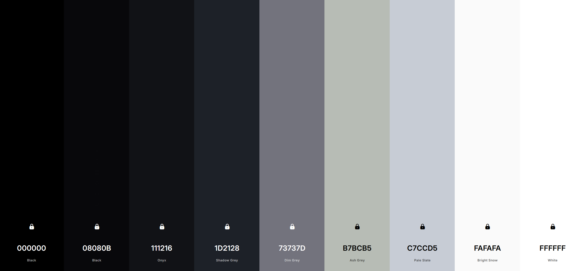

- https://vivsha.ws, my webbed site
- time for a redesign, i think. i know exactly enough about #design to know that I'm not very good at it 😅
- thinking about look & feel:
	- i want to be more minimalist and more typographic. 90% of the space and graphics on my site currently are Pointless. the site should not contain pointless things. text is fine and good.
	- first inclination is something similar to [Context (Super theme)](https://context.super.site/)
		- but with plain black & white colors, for actually readable contrast
		- and... [the blog page layout](https://context.super.site/blog/think) has super poor readability. need a better idea
			- maybe consider something like [Aeon's layout](https://aeon.co/essays/is-it-possible-to-hold-truly-contradictory-beliefs-together)? that's super legible
			- or [Epoche](https://epochemagazine.org/65/section-23-the-berkeleian-unconscious-marx/)- the article layout here is quite nice!
- thinking about typefaces:
	- i want a serif as my core typeface, ideally something both very legible _and_ with oodles of unique character
		- [Academica](https://www.stormtype.com/families/academica) is a rather nice serif. I particularly like the angular italic.
		- on balance, i might like [Canela](https://commercialtype.com/catalog/canela) better, esp. now that it has book faces
		- if i'm not committed yet to buying, could start with [Orpheus](https://fonts.adobe.com/fonts/orpheus) as I've got adobe
		- there's [Tobias](https://displaay.net/typeface/tobias/) as well, which I've recently discovered and is _quite_ nice
		- ended up on MB Type's Equity
	- do i even need a sans? I'm not sure that I do. could go with just one typeface
		- i _love_ love [Agrandir](https://pangrampangram.com/products/agrandir), would be cool to have an excuse to use it
		- ended up on MB Type's Concourse
- [Compact Mag has a really nice text layout](https://www.compactmag.com/article/the-crisis-of-the-university-started-long-before-trump/)
- [Brandur](https://brandur.org/) accomplishes something similar to my site but better
- Rebecca Murphey [has a very well-written EM resume section](https://rmurphey.com/about/)
- henry from online is great at this: https://henry.codes/writing/a-website-to-destroy-all-websites/
- [aresluna](https://aresluna.org/) is an amazing type-heavy, highly readable site with its own flare
	- including [this neat TOC](https://aresluna.org/design-details-table-of-contents/)
- good sidenotes:
	- https://practicaltypography.com/why-racket-why-lisp.html
	- Jake Lazaroff [has a nice, typography-focused post layout](https://jakelazaroff.com/words/homomorphically-encrypted-crdts/)
	- the Thinking Machines blog has really nice sidenotes: https://thinkingmachines.ai/blog/lora/
- palette:
	- dark mode https://coolors.co/111216-1d2128-73737d-b7bcb5-c7ccd5
	- light mode https://coolors.co/ffffff-fafafa-73737d-08080b-000000
	- unified https://coolors.co/000000-08080b-111216-1d2128-73737d-b7bcb5-c7ccd5-fafafa-ffffff
	- 
	- not sure how I like this. `#B7BCB5` is a bit too yellow-green. i'd potentially like a light cream color rather than sharp white for some things in light mode. there's big jumps between some values, but small ones between others. the warmth/coolness seems off across the scale values.
	- updated to interpolate one more value: https://coolors.co/000000-08080b-111216-1d2128-484a53-73737d-b7bcb5-c7ccd5-fafafa-ffffff
- inspiration:
	- [Strangers By Spring](https://strangersbyspring.com/) is so dang good. great monochromatic palette, cool image effect
	- [VH Belvadi](https://vhbelvadi.com/) is an exemplary text-first site with great features
	- [Butterick's Practical Typography](https://practicaltypography.com/) is highly legible-text-heavy, and uses sidenotes
	- [Maggie Appleton](https://maggieappleton.com/gastown)'s blog posts have a fantastic layout
	- [Tufte CSS](https://edwardtufte.github.io/tufte-css/) - great text-driven layout, sidenotes
	- https://games.porg.es/games/pigeon-lottery/ - sidenotes