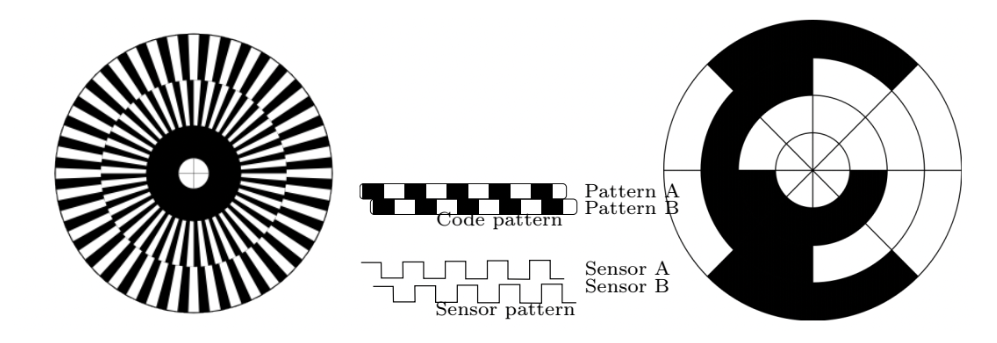

tags:: sensors
alias:: joint encoder

- uses a patterned wheel with an optic sensor to determine how far a motor has turned.
	- if we also want direction, we can use two offset disks and check which disk we saw first.
	- if we want absolute measurement, we can do that too with a binary-encoded wheel
	- they look something like this! standard quadrature encoder left, absolute encoder right
		- {:height 193, :width 533}